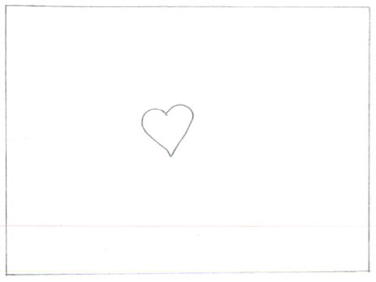
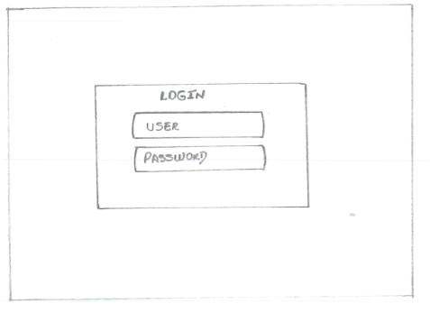
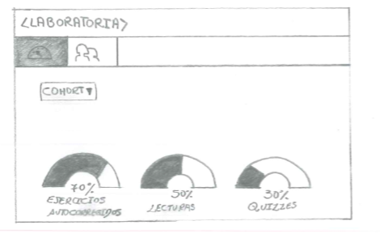
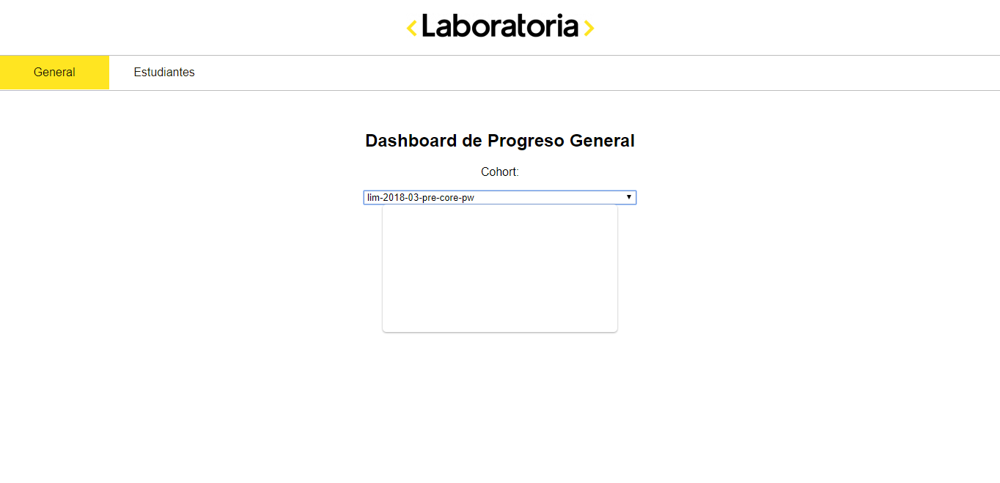

# Data Dashboard (Proyecto 2 CC)

## Colaboradoras

* Maricruz Enrique Rivera
* Yanina Portal Loarte

## Inicio del Proyecto.

Al concluir la lectura del readme por primera vez , se puede llegar a las siguientes conclusiones:

**Nuestro público objetivo será las Trading Manager ya que son las  encargadas de seguir los avances de aprendizaje.**

**La data que se manipulara corresponde al LMS (Learning Management System) , que contiene lecturas , ejercicios y quizzes ; con dicha información  permite  a las estudiantes de Laboratoria completar los retos  planteados , de manera exitosa.**

**El LMS acumula data sobre el progreso de aprendizaje de las estudiantes; con respecto a las lecturas y  ejercicios que se hayan completado y los resultados de los quizzes.**

**Para su mejor visualización y manejo de la data se creara un data dashboard (tablero de visualización de datos).**

#### Topicos a cubrir.

Para completar el proyecto de manera exitosa se tendrá que tomar en cuenta los siguientes temas :

**Arrays, objects, dom, xhr y visual design.**

**Reforzar lo aprendido anteriormente : valores, tipos, variables, control de flujo y tests unitarios.**

### Especificaciones del proyecto.

La lógica del proyecto debe estar implementada completamente en **JavaScript (ES6), HTML y CSS**. En este proyecto *NO está permitido usar librerías o frameworks, solo vanilla JavaScript*.

*No se debe utilizar la pseudo-variable this*.

Los tests unitarios deben cubrir un  *mínimo del 70% de statements, functions y lines, y un mínimo del 50% de branches*.

Para comenzar tendrás que hacer un fork y clonar este repositorio que contiene el boilerplate.

### Entregable.

Los **criterios mínimos de aceptación** para considerar que se ha completado este proyecto son los siguientes :

### User Experience Design

1) Definicion del producto.

Documentar como fue el proceso para definir el producto final a nivel de experiencia y de interfaz ,

2) Sketch de la solución.

Realizar el sketch (boceto solo usando papel y lapiz), de una posible solución.

3) Diseño de la interfaz de usuario (prototipo de alta fidelidad).

El diseño debe ser el ideal a presentar , el que se implementaria si se tuviera el tiempo ilimitado.

La herramienta que nos suguieren usar es Figma.

### Implementación de la Interfaz de Usuario (HTML/CSS/JS)

Como mínimo, se debe  implementar  lo siguiente :

1.-Permitir al usuario seleccionar un cohort de una lista de cohorts.

2.-**Al seleccionar un cohort:**

   Listar las estudiantes de ese cohort.
   
   Para cada estudiante:

    *Calcular porcentaje de completitud de todos los cursos.

    *Calcular grado de completitud de lecturas, ejercicios autocorregidos, y quizzes.

   Ordenar estudiantes por completitud general (porcentaje consumido/completado de todos los cursos del cohort en cuestión), de lecturas, ejercicios autocorregidos y quizzes.

   Filtrar/buscar estudiantes por nombre.

3.-Visualizarse sin problemas desde distintos tamaños de pantallas: móviles, tablets y desktops.

4.-Incluir pruebas unitarias.

Es importante que tu interfaz, a pesar de ser una versión mínima de tu ideal, igual debe seguir los fundamentos de visual design, como: contraste, alineación, jerarquía, entre otros.

### Detalles de Implementación

Para llevar a cabo el proyecto , nuestros coaches nos compartiran un link de un repositorio el cual contiene carpetas y archivos 

A continuación se menciona de manera general lo que cada archivo debe contener.

**data.js**

El objetivo de este proyecto es la manipulación de datos a tráves de arreglos y objetos .

Para ello nos piden implementar 4 fuciones y exportarlo al entorno global (window).

1) computeUsersStats(users, progress, courses).

2) sortUsers(users, orderBy, orderDirection).

3) filterUsers(users, search).

4) processCohortData(options).

**main.js**

Este archivo debe contener los datos que se mostraran en pantalla .

**index.html**

Este archivo contendrá la página que se mostara al usuario que haga uso del tablero de información.

**DATA**

Esta carpeta contiene los datos de prueba del proyecto , contiene información sobre los cohorts (grupos de estudiantes de una generación y rama en particular) ,estudiantes y su progreso en cada uno de los cursos que son parte del cohort.

**Tests**

Completar las pruebas unitarias de estas funciones que se incluyen en el boilerplate .

**index.html**

No se debe confundir con el archivo *index.html* del proyecto , este archivo es especial para los test y es una manera de ver el resultado de las pruebas unitarias, pero en el navegador.

**fixtures.js**

Contiene el set de datos de prueba que se usarán para correr las pruebas.

#### SPRINT 1 

## Paso 1

Nuestros coaches nos compartieron un link de un  repositorio el cual contiene el  planteamiento del reto .

Maricruz procedió a realizar el fork de dicho repositorio e  hice un fork del repositorio de mi compañera y configure un *remote* hacia el mismo.

Clonamos el fork a nuestra computadora (copia local). 

Creamos una nueva rama.

Comandos que usamos para realizar dichos pasos :

<pre> Fork de Laboratoria : Maricruz

Fork de Maricruz : Yanina

Ambas clonamos desde nuestros repositorios.
 
- git clone http...
 
 Yanina añade un nuevo remoto.
 
- git remote -v

- git remote add upstream https://github.com/User/RepoOriginal(Forkeado)

Creación de una nueva rama (develop)

Estando en Master.

- git checkout -b develop

Subimos la rama develop al github.
 
- git push origin develop
 
Ya está creado la rama.

Vincular rama.

Yanina:

Se muestra los dos remotos (master de Yanina, upstream de Maricruz)

- git remote -v

Consulta modificaciones
 
- git fetch upstream

Se muestra las dos ramas en el repo de Maricruz

Cambiar a la rama borrador ambas.

- git checkout borrador marked </pre>

## Paso 2 

Leer los temas que se emplearan para desarrollar el reto (Array , Object) que se encuentra en el LMS.

## Paso 3 

Iniciar la documentación en el readme , mencionando la instalación del entorno de trabajo y los temas que se estudiaron.

## Paso 4 

### Proceso de Diseño.

Diseño  del Sketch , cuyas conclusiones  se  basan en la primera lectura ; como una posible solución.

> Primer boceto.

Al ser nuestro público objetivo la Trading Manager ya que es  la encargada de realizar el seguimiento de nuestros avances mediante la manipulación y visualización de la data que estan representados en gráficos para una rápida lectura.

Se procedio a la entrevista para mostrar el primer boceto y mediante la formulación de preguntas ir modificando dicho boceto.

Como consecuancia de la entrevista se llegó a las siguientes conclusiones :

* Unir la lista de alumnos y los porcentajes ya que estaban separados , ya que nuestra idea inicial era que ese cuadro desapareciara  al momento de que seleccionara el nombre de una alumna , por lo tanto deberia estar separado ; pero la observición de la Trading Manager era que deberian estar juntos para que pueda relacionar alumna y porcentaje de avance.

* La prioridad de cursos , en primer lugar ejercicios autocorregidos  , seguido lecturas y  por ultimo quizzes.

* Nos indico los gráficos de cada curso en especifico (ejercicios , lecturas y quizzes) en caso de llegar al Hacking Edition , para lecturas grafico circular , para quizzes y ejercicios graficos en barra.

* Poder distinguir segun los colores de fondo el avance en modo general con un color en especifico , por ejemplo : 
Del 0-40% en color rojo , del 40% - 60% color amarillo y del 60% al 100% en color verde.

* Otro elemento que se podria tomar en cuenta seria una nueva pagina en donde pueda tener acceso a un promedio general.

## Prototipo de Alta Fidelidad.

Es el diseño ideal que se entregaria de tener un tiempo ilimitado.

### Objetivo del Producto
**El acceso que tendra la Trading Manager a la data mediante gráficos de rapida lectura , organizado de una manera que pueda encontrar la informacion  que  facilitara su labor .

Obteniendo en primer lugar una vista general  en donde se puede visualizar el  promedio  del cohort que se elija , y en otra pestaña poder obtener con mayor detalle el avance de cada alumna.**

**El problema que sera resuelto.
** Los datos que se manipularan.

## Datos relevantes.

A raiz de la entrevista se pudo concluir los datos que consideraba más relevantes por ello la distribución de los elementos como se puede apreciar en el diseño de Alta Fidelidad.

## Frecuencia de revision de datos.

Los datos son revisados semanalmente por la Trading Manager.

## Resolucion del problema.

Tendra acceso a la data mediante graficos de rapida lectura , obteniendo en primer lugar una vista general  en donde se puede visualizar el  promedio  del cohort que se elija , y en otra pestaña poder obtener con mayor detalle el avance de cada alumna.

### Sprint 2

Actualización del readme .

Se procede a obtener la data y a la investigación para crear la 4ta función y 2da función.

## Sprint 3

* Para la demo 3, tenemos casi el 70% del proyecto culminado.

## Sprint 4 

Se presenta el proyecto el final.

